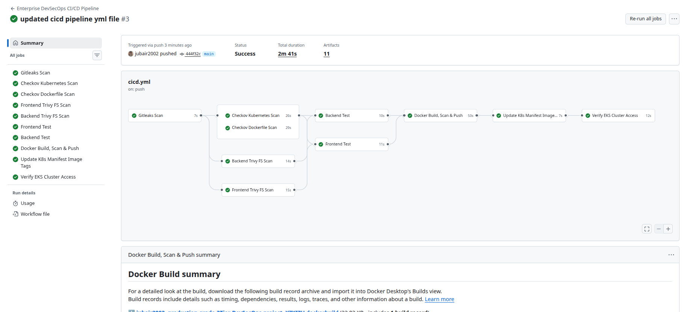
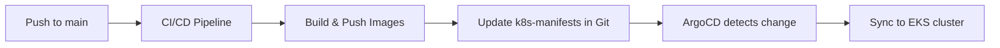
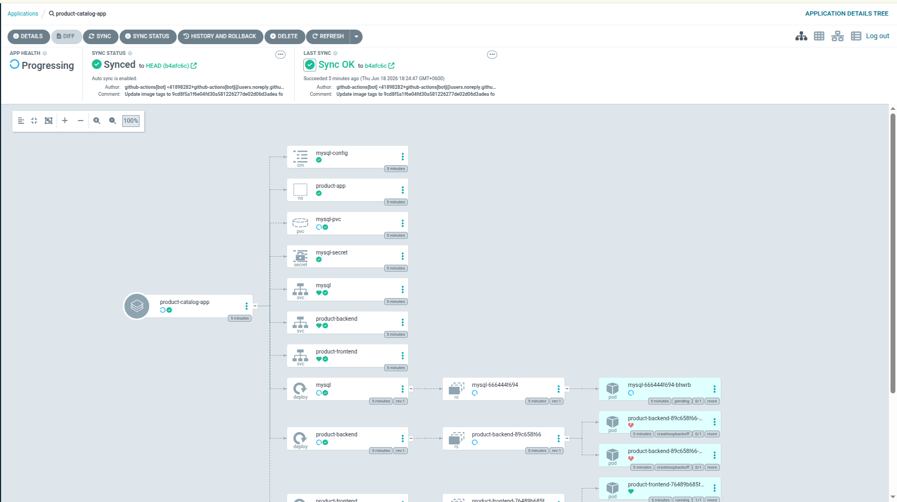

# DevSecOps CI/CD Pipeline Guide

This document explains the **complete CI/CD pipeline** for the Production-Grade 3-Tier DevSecOps project. Use it to brief clients, stakeholders, or new team members.

---

## Pipeline Summary

| Item | Value |
|------|-------|
| Platform | GitHub Actions |
| Workflow file | `.github/workflows/cicd.yml` |
| Trigger branch | `main` |
| Deployment model | **GitOps** (ArgoCD on EKS) |
| Container registry | Docker Hub |
| Backend image | `jubair2002/productbackend` |
| Frontend image | `jubair2002/productfrontend` |
| EKS cluster | `jubair-eks-cluster-testing` (`us-east-1`) |



---

## High-Level Flow



### What happens on every code push

1. Security scans run first (shift-left).
2. Application tests run for Frontend and Backend.
3. Docker images are built and scanned.
4. Images are pushed to Docker Hub with commit SHA tags.
5. Kubernetes manifest image tags are updated in Git.
6. ArgoCD detects Git change and deploys to EKS.
7. Pipeline verifies EKS connectivity (no `kubectl apply` in CI).

---

## When the Pipeline Runs

The workflow triggers on push to `main` when these paths change:

- `Frontend/**`
- `Backend/**`
- `k8s-manifests/**`
- `.github/workflows/cicd.yml`

Commits that only change docs/README may not trigger the pipeline unless workflow paths are updated.

---

## Prerequisites (One-Time Setup)

### 1. GitHub Repository Secrets

Go to **GitHub → Repository → Settings → Secrets and variables → Actions**

| Secret Name | Required | Purpose |
|-------------|----------|---------|
| `AWS_ACCESS_KEY_ID` | Yes | AWS authentication for EKS verification |
| `AWS_SECRET_ACCESS_KEY` | Yes | AWS authentication for EKS verification |
| `DOCKERHUB_TOKEN` | Yes | Push Docker images to Docker Hub |

### 2. GitHub Repository Variables

Go to **Settings → Secrets and variables → Actions → Variables**

| Variable Name | Example | Purpose |
|---------------|---------|---------|
| `DOCKERHUB_USERNAME` | `jubair2002` | Docker Hub login username |

### 3. Infrastructure Prerequisites

- EKS cluster running (`jubair-eks-cluster-testing`)
- ArgoCD installed and watching `k8s-manifests/`
- Docker Hub repositories created:
  - `jubair2002/productbackend`
  - `jubair2002/productfrontend`

---

## Pipeline Stages (Detailed)

### Stage 1 — Secret Scanning

**Job:** `Gitleaks Scan`

| Step | Action |
|------|--------|
| Checkout code | Pull repository source |
| Run Gitleaks | Scan for hardcoded secrets, tokens, passwords |
| Upload report | Save `gitleaks-report.json` as artifact |

**Why it matters:** Prevents accidental credential leaks before build/deploy.

---

### Stage 2 — Security Scans (Parallel)

These jobs run in parallel after Gitleaks:

#### Job: `Checkov Kubernetes Scan`

- Scans `k8s-manifests/` for Kubernetes misconfigurations
- Produces `checkov-k8s-report.json`

#### Job: `Checkov Dockerfile Scan`

- Scans Dockerfiles for insecure patterns
- Produces `checkov-dockerfile-report.json`

#### Job: `Frontend Trivy FS Scan`

- Scans `Frontend/` dependencies and files
- Severity focus: `HIGH`, `CRITICAL`
- Produces JSON + table reports

#### Job: `Backend Trivy FS Scan`

- Scans `Backend/` dependencies and files
- Severity focus: `HIGH`, `CRITICAL`
- Produces JSON + table reports

**Why it matters:** Security validation happens before testing and deployment.

---

### Stage 3 — Application Testing

#### Job: `Frontend Test`

Prerequisites:

- Frontend Trivy FS scan
- Checkov K8s scan
- Checkov Dockerfile scan

Steps:

1. Setup Node.js 18
2. `npm ci` in `Frontend/`
3. `npm test --if-present`

#### Job: `Backend Test`

Prerequisites:

- Backend Trivy FS scan
- Checkov K8s scan
- Checkov Dockerfile scan

Steps:

1. Setup Node.js 18
2. `npm ci` in `Backend/`
3. `npm test --if-present`

**Why it matters:** Ensures basic application integrity before image build.

---

### Stage 4 — Docker Build, Scan & Push

**Job:** `Docker Build, Scan & Push`

Runs only after Frontend and Backend tests complete.

| Step | Description |
|------|-------------|
| Login to Docker Hub | Uses `DOCKERHUB_USERNAME` + `DOCKERHUB_TOKEN` |
| Build Backend image | Context: `./Backend` |
| Build Frontend image | Context: `./Frontend` |
| Trivy image scan | Scan both images for HIGH/CRITICAL CVEs |
| Push Backend image | Tags: `<sha>` and `latest` |
| Push Frontend image | Tags: `<sha>` and `latest` |

Image examples after build:

```
jubair2002/productbackend:2011c4f569256cdd08de19dfae350c3d1f1c8e7f
jubair2002/productbackend:latest

jubair2002/productfrontend:2011c4f569256cdd08de19dfae350c3d1f1c8e7f
jubair2002/productfrontend:latest
```

**Why it matters:** Every release is traceable by Git commit SHA.

---

### Stage 5 — GitOps Manifest Update

**Job:** `Update K8s Manifest Image Tags`

This is the bridge between CI and CD.

| Step | Description |
|------|-------------|
| Checkout `main` | Get latest manifests |
| Update backend tag | `k8s-manifests/backend/deployment.yaml` |
| Update frontend tag | `k8s-manifests/frontend/deployment.yaml` |
| Commit + push | Commit message includes `[skip ci]` |

Updated manifest example:

```yaml
image: jubair2002/productbackend:2011c4f569256cdd08de19dfae350c3d1f1c8e7f
```

**Important:** CI does **not** deploy with `kubectl apply`. It only updates Git.

---

### Stage 6 — EKS Connectivity Verification

**Job:** `Verify EKS Cluster Access`

| Step | Description |
|------|-------------|
| Configure AWS credentials | Uses GitHub secrets |
| Setup kubectl | Installs kubectl in runner |
| Verify cluster | `aws eks update-kubeconfig` + `kubectl get nodes` |

Purpose:

- Confirms AWS credentials are valid
- Confirms EKS cluster is reachable
- Confirms pipeline environment is correctly configured

Deployment itself is handled by **ArgoCD**.

---

## GitOps Deployment (ArgoCD)

After Stage 5 commits manifest changes, ArgoCD takes over.

ArgoCD Application config:

- **Repo:** `https://github.com/jubair2002/production-grade-3Tier-DevSecOps-project.git`
- **Path:** `k8s-manifests`
- **Branch:** `main`
- **Namespace:** `product-app`
- **Auto sync:** enabled
- **Self heal:** enabled
- **Prune:** enabled



### What ArgoCD deploys

- Namespace: `product-app`
- Frontend Deployment + NodePort Service (`30080`)
- Backend Deployment + NodePort Service (`30500`)
- MySQL Deployment + PVC + Secret + ConfigMap + NodePort Service (`30306`)

---

## End-to-End Timeline (Typical Run)

| Order | Job | Approx. Duration |
|-------|-----|------------------|
| 1 | Gitleaks Scan | ~10s |
| 2 | Checkov + Trivy scans (parallel) | ~20–30s |
| 3 | Frontend/Backend tests | ~10–15s |
| 4 | Docker Build, Scan & Push | ~45–60s |
| 5 | Update K8s Manifest Image Tags | ~5–10s |
| 6 | Verify EKS Cluster Access | ~10–15s |

**Total:** ~2–3 minutes (varies by runner load)

---

## What CI Does vs What ArgoCD Does

| Responsibility | CI/CD Pipeline | ArgoCD |
|----------------|----------------|--------|
| Security scanning | Yes | No |
| Unit testing | Yes | No |
| Build Docker images | Yes | No |
| Push images to registry | Yes | No |
| Update manifest tags in Git | Yes | No |
| Apply manifests to cluster | **No** | **Yes** |
| Monitor drift and self-heal | No | Yes |
| Rollback by Git revert | Indirect | Yes |

This separation is intentional — it is the **GitOps** model.

---

## How to Trigger a Deployment

1. Make code changes in `Frontend/` or `Backend/`
2. Commit and push to `main`
3. GitHub Actions pipeline runs automatically
4. Pipeline updates image tags in `k8s-manifests/`
5. ArgoCD syncs new manifests to EKS
6. Kubernetes rolls out new pods

Manual trigger option:

- GitHub → **Actions** → **Enterprise DevSecOps CI/CD Pipeline** → **Run workflow**

---

## How to Verify a Successful Release

### In GitHub Actions

1. Open latest workflow run
2. Confirm all jobs are green
3. Download artifacts (Gitleaks, Checkov, Trivy reports)

### In GitHub Repository

Check latest commit from `github-actions[bot]`:

```
Update image tags to <SHA> for ArgoCD sync [skip ci]
```

### In ArgoCD UI

- Application: `product-catalog`
- Sync Status: `Synced`
- Health: `Healthy` / `Progressing` during rollout

### In EKS

```bash
kubectl get pods -n product-app
kubectl get deploy -n product-app
```

Check image tag on running deployment:

```bash
kubectl get deploy product-backend -n product-app -o jsonpath='{.spec.template.spec.containers[0].image}{"\n"}'
kubectl get deploy product-frontend -n product-app -o jsonpath='{.spec.template.spec.containers[0].image}{"\n"}'
```

---

## Rollback Procedure

Because deployment is Git-based, rollback is done by reverting manifest changes.

### Option 1 — Revert Git commit

```bash
git revert <commit-sha>
git push origin main
```

ArgoCD will sync the previous image tag automatically.

### Option 2 — Manual sync to previous Git revision in ArgoCD

1. Open ArgoCD UI
2. Select application `product-catalog`
3. View History
4. Sync to previous known-good revision

---

## Common Pipeline Issues

### Push rejected: `fetch first`

**Cause:** CI bot committed image-tag updates to `main`.

**Fix:**

```bash
git pull --rebase origin main
git push origin main
```

---

### Docker push failed

**Cause:** Invalid `DOCKERHUB_TOKEN` or missing `DOCKERHUB_USERNAME` variable.

**Fix:** Re-check GitHub secrets/variables.

---

### EKS verify step failed

**Cause:** Wrong region or invalid AWS credentials.

**Fix:**

- Region must be `us-east-1`
- Validate `AWS_ACCESS_KEY_ID` and `AWS_SECRET_ACCESS_KEY`

---

### ArgoCD synced but pods not updated

**Cause:** Manifest tags in Git did not change, or image not pushed.

**Fix:**

1. Confirm CI pushed images to Docker Hub
2. Confirm `k8s-manifests/*/deployment.yaml` has new SHA tag
3. Re-sync application in ArgoCD

---

## Security & Compliance Notes

- Secrets are scanned on every run (Gitleaks)
- Kubernetes and Dockerfile policies are checked (Checkov)
- Dependencies and images are vulnerability-scanned (Trivy)
- Scan reports are stored as GitHub Actions artifacts
- `.env` files are excluded from Git via `.gitignore`
- Production credentials should be managed via Kubernetes Secrets (or AWS Secrets Manager for hardened setups)

---


## Related Documents

- [Main Project README](../README.md)
- [EKS Cluster Setup Guide](./EKS-CLUSTER-SETUP.md)
- [ALB Ingress Setup Guide](./ALB-INGRESS-SETUP.md)
- [Monitoring Setup Guide](./MONITORING-SETUP.md)
